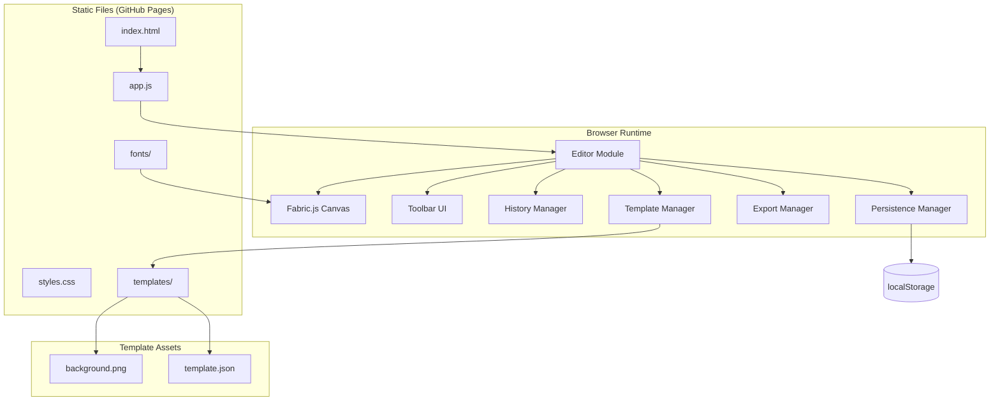
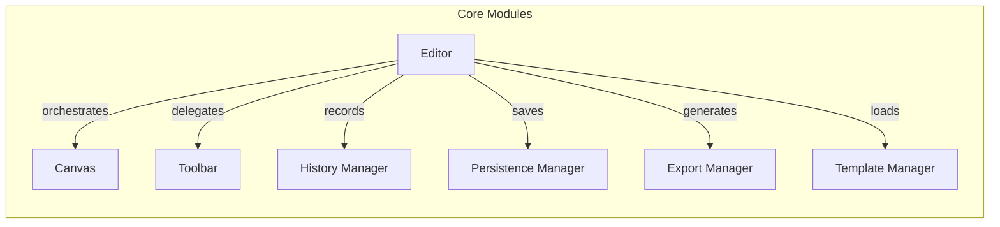

# Design Document: Poster Customizer

## Overview

The Poster Customizer is a fully client-side, static web application that enables users to customize event posters for the Hoss Hangmen band. It loads pre-designed poster templates (extracted from an existing PowerPoint presentation) and provides an interactive canvas editor for modifying text, repositioning elements, resizing, changing fonts/colors, and exporting as PNG.

### Key Technical Decisions

| Decision | Choice | Rationale |
|----------|--------|-----------|
| Canvas Library | Fabric.js (v6.x via CDN) | Provides object model for canvas, built-in interactivity (drag, resize, select), JSON serialization/deserialization, and PNG export with multiplier for high-DPI. Available via CDN with no build step. |
| No Build Step | Vanilla HTML/CSS/JS + CDN | Requirement 6 mandates no compilation. All files served directly as static assets. |
| State Persistence | Browser localStorage with Fabric.js JSON serialization | `canvas.toJSON()` / `canvas.loadFromJSON()` provide full round-trip state serialization. |
| PNG Export | Fabric.js `toDataURL()` with multiplier | The multiplier option scales the output resolution to meet 150 DPI print requirements without altering the display canvas. |
| Template Extraction | R `officer` package (one-time offline script) | Extracts text positions/styles from PPTX. Background artwork exported manually as high-res PNG from PowerPoint. |
| Undo/Redo | JSON snapshot stack | Full canvas state snapshots stored in an array. Simple, reliable, and compatible with Fabric.js serialization. |
| Font Loading | `@font-face` CSS with local WOFF2 files | Custom typefaces bundled in the repo, no external font services. |

## Architecture



### Module Responsibilities



## Components and Interfaces

### 1. Editor (Main Orchestrator)

The central module that initializes all sub-modules and coordinates interactions between them.

```javascript
// editor.js
const Editor = {
    canvas: null,          // Fabric.js Canvas instance
    history: null,         // History Manager instance
    persistence: null,     // Persistence Manager instance
    templateManager: null, // Template Manager instance

    init(canvasElementId),      // Initialize the editor
    onObjectModified(event),    // Handle canvas object changes
    onSelectionChanged(event),  // Handle selection changes to update toolbar
    destroy()                   // Cleanup event listeners
};
```

### 2. Template Manager

Loads and manages poster templates from static JSON configuration files.

```javascript
// templateManager.js
const TemplateManager = {
    templates: [],         // Array of available template metadata
    currentTemplate: null, // Currently loaded template name

    async loadTemplateList(),                    // Discover available templates
    async loadTemplate(templateName),            // Load a specific template onto canvas
    getTemplateConfig(templateName),             // Get JSON config for a template
    renderTemplateThumbnails(containerElement),   // Render template selector UI
};
```

### 3. History Manager (Undo/Redo)

Manages undo/redo state using JSON snapshots of the canvas.

```javascript
// historyManager.js
const HistoryManager = {
    undoStack: [],     // Array of JSON state strings
    redoStack: [],     // Array of JSON state strings
    maxHistory: 50,    // Maximum undo depth
    isRestoring: false, // Flag to prevent recording during restore

    saveState(canvas),  // Push current state to undo stack
    undo(canvas),       // Pop undo stack, push to redo, restore canvas
    redo(canvas),       // Pop redo stack, push to undo, restore canvas
    canUndo(),          // Returns boolean
    canRedo(),          // Returns boolean
    clear()             // Reset both stacks
};
```

### 4. Persistence Manager

Handles auto-saving and restoring canvas state from localStorage.

```javascript
// persistenceManager.js
const PersistenceManager = {
    storageKey: 'poster-customizer-state',
    templateKey: 'poster-customizer-template',
    saveTimeout: null,

    scheduleSave(canvas),           // Debounced save (within 2 seconds)
    save(canvas),                   // Immediately save to localStorage
    restore(canvas),                // Restore saved state, returns boolean
    hasSavedState(),                // Check if valid state exists
    clear(),                        // Remove saved state
    getLastTemplate(),              // Get last used template name
    setLastTemplate(templateName),  // Store last used template name
};
```

### 5. Export Manager

Generates high-resolution PNG from the canvas.

```javascript
// exportManager.js
const ExportManager = {
    exportAsPNG(canvas, templateConfig), // Generate and download PNG
    calculateMultiplier(canvas, templateConfig), // DPI-based multiplier
    triggerDownload(dataURL, filename),  // Create download link
    generateFilename(),                  // "poster-YYYY-MM-DD.png"
};
```

### 6. Toolbar

Renders and manages the editing toolbar (font controls, color picker, undo/redo buttons, export, template selector, add text, reset).

```javascript
// toolbar.js
const Toolbar = {
    init(editor),                        // Setup toolbar event listeners
    updateForSelection(activeObject),    // Show/hide controls based on selection
    updateUndoRedoState(canUndo, canRedo), // Enable/disable undo/redo buttons
    getFontSize(),                       // Get current font size control value
    getFontFamily(),                     // Get current font family selection
    getFontColor(),                      // Get current color picker value
};
```

### 7. Responsive Layout Manager

Handles canvas scaling and toolbar repositioning based on viewport size.

```javascript
// responsiveManager.js
const ResponsiveManager = {
    breakpoint: 768,   // px threshold for layout switch

    init(canvas, containerElement),  // Setup resize observer
    recalculateLayout(),             // Recompute scale and toolbar position
    getCanvasScale(),                // Current scale factor
    isNarrowViewport(),              // Whether we're below breakpoint
};
```

## Data Models

### Template Configuration JSON

Each template has a JSON configuration file defining its metadata, dimensions, and placeholder elements:

```json
{
    "name": "Hoss Hangmen - Dark",
    "version": "1.0",
    "dimensions": {
        "width": 1100,
        "height": 1700,
        "unit": "px",
        "physicalWidth": 11,
        "physicalHeight": 17,
        "physicalUnit": "in"
    },
    "background": {
        "src": "background.png",
        "width": 1100,
        "height": 1700
    },
    "placeholders": [
        {
            "id": "event-date",
            "type": "text",
            "defaultText": "Enter Date Here",
            "x": 220,
            "y": 1350,
            "width": 660,
            "height": 80,
            "fontFamily": "The Serif Hand Black",
            "fontSize": 36,
            "fontColor": "#FFFFFF",
            "textAlign": "center"
        },
        {
            "id": "venue-name",
            "type": "text",
            "defaultText": "Enter Venue Name",
            "x": 220,
            "y": 1440,
            "width": 660,
            "height": 80,
            "fontFamily": "The Serif Hand Extrablack",
            "fontSize": 32,
            "fontColor": "#FFFFFF",
            "textAlign": "center"
        },
        {
            "id": "event-details",
            "type": "text",
            "defaultText": "Additional Details",
            "x": 220,
            "y": 1530,
            "width": 660,
            "height": 60,
            "fontFamily": "The Serif Hand Black",
            "fontSize": 24,
            "fontColor": "#CCCCCC",
            "textAlign": "center"
        }
    ],
    "fonts": [
        {
            "family": "The Serif Hand Black",
            "src": "fonts/TheSerifHand-Black.woff2",
            "weight": "normal",
            "style": "normal"
        },
        {
            "family": "The Serif Hand Extrablack",
            "src": "fonts/TheSerifHand-Extrablack.woff2",
            "weight": "900",
            "style": "normal"
        }
    ]
}
```

### Fonts Configuration List

A `fonts.json` file at the root of the templates directory lists all available typefaces. Adding a new font only requires adding an entry here and placing the font file in the `fonts/` directory:

```json
{
    "fonts": [
        {
            "family": "The Serif Hand Black",
            "file": "fonts/TheSerifHand-Black.woff2",
            "weight": "normal"
        },
        {
            "family": "The Serif Hand Extrablack",
            "file": "fonts/TheSerifHand-Extrablack.woff2",
            "weight": "900"
        }
    ]
}
```

### Templates Directory Structure

```
templates/
├── index.json              # List of available templates with names/thumbnails
├── hoss-dark/
│   ├── template.json       # Template configuration
│   ├── background.png      # High-res background artwork
│   └── thumbnail.png       # Small preview for selector
├── hoss-red/
│   ├── template.json
│   ├── background.png
│   └── thumbnail.png
fonts/
├── fonts.json              # Available fonts list
├── TheSerifHand-Black.woff2
└── TheSerifHand-Extrablack.woff2
```

### Canvas State (Fabric.js JSON)

The canvas state serialized by `canvas.toJSON()` follows the Fabric.js schema. Custom properties are included via the `propertiesToInclude` option:

```json
{
    "version": "6.0.0",
    "objects": [
        {
            "type": "Textbox",
            "left": 220,
            "top": 1350,
            "width": 660,
            "height": 80,
            "text": "March 15, 2025",
            "fontFamily": "The Serif Hand Black",
            "fontSize": 36,
            "fill": "#FFFFFF",
            "textAlign": "center",
            "placeholderId": "event-date"
        }
    ],
    "background": "",
    "backgroundImage": {
        "type": "Image",
        "src": "templates/hoss-dark/background.png"
    }
}
```

### Persistence Storage Schema

```json
{
    "poster-customizer-state": "<Fabric.js canvas JSON string>",
    "poster-customizer-template": "hoss-dark"
}
```

### Undo/Redo Stack Entry

Each entry in the undo/redo stack is a full Fabric.js canvas JSON string (from `canvas.toJSON()`). This is simple and robust, though memory-intensive for very complex canvases — acceptable here since poster templates have a small number of objects (~3–10 text elements).


## Correctness Properties

*A property is a characteristic or behavior that should hold true across all valid executions of a system — essentially, a formal statement about what the system should do. Properties serve as the bridge between human-readable specifications and machine-verifiable correctness guarantees.*

### Property 1: State Persistence Round-Trip

*For any* valid canvas state (containing any combination of text elements with varying positions, sizes, fonts, colors, and content), serializing the state to localStorage via `JSON.stringify(canvas.toJSON())` and then restoring via `canvas.loadFromJSON()` should produce a canvas state with equivalent object properties (positions, dimensions, text content, styling).

**Validates: Requirements 9.2**

### Property 2: Corrupted State Graceful Handling

*For any* arbitrary string stored in the localStorage persistence key (including malformed JSON, truncated JSON, empty strings, and random byte sequences), the Editor SHALL load the default template without throwing an uncaught exception and the canvas SHALL contain the expected default placeholder elements.

**Validates: Requirements 9.3**

### Property 3: Undo/Redo Round-Trip

*For any* canvas state S and any valid edit action A (text change, position move, resize, font change, or element addition), performing A to reach state S', then undoing to return to S, then redoing should yield a state equivalent to S'. That is: `redo(undo(apply(S, A))) ≡ apply(S, A)`.

**Validates: Requirements 11.1, 11.2, 11.3**

### Property 4: New Edit After Undo Clears Redo Stack

*For any* sequence of edit actions followed by one or more undo operations (producing a non-empty redo stack), performing any new edit action SHALL result in an empty redo stack.

**Validates: Requirements 11.4**

### Property 5: Undo Stack Capacity

*For any* sequence of N edit actions where N > 50, the undo stack SHALL contain exactly 50 entries (the 50 most recent actions), and undoing 50 times should be possible without error.

**Validates: Requirements 11.5**

### Property 6: Element Bounds Constraint

*For any* element with any width and height, after being positioned at any coordinates on the canvas, the element's bounding box (left, top, left+width, top+height) SHALL be fully contained within the canvas boundaries (0, 0, canvasWidth, canvasHeight).

**Validates: Requirements 3.4**

### Property 7: Resize Dimension Constraints

*For any* element and any resize operation (scaling from any handle by any delta), the resulting element dimensions SHALL satisfy: width ≥ 10px, height ≥ 10px, the element remains within canvas boundaries, and the aspect ratio (width/height) remains equal to the original aspect ratio (within floating-point tolerance of 0.01).

**Validates: Requirements 4.2, 4.4, 4.5**

### Property 8: Canvas Scale Preserves Aspect Ratio

*For any* viewport dimensions (width ≥ 320px, height ≥ 200px) and any poster dimensions (width > 0, height > 0), the computed canvas scale factor SHALL produce a displayed canvas where: (a) the aspect ratio of the displayed canvas equals the poster's aspect ratio (within 0.01 tolerance), (b) the displayed canvas fits within the available viewport area, and (c) the scale does not exceed 1.0 (never upscales beyond original dimensions).

**Validates: Requirements 8.1**

### Property 9: Export Filename Format

*For any* valid Date object, the generated export filename SHALL match the regex pattern `^poster-\d{4}-\d{2}-\d{2}\.png$` and the embedded date components SHALL correspond to the year, month, and day of the input date.

**Validates: Requirements 5.2**

### Property 10: Export DPI Multiplier Correctness

*For any* template configuration with physical dimensions (physicalWidth in inches, physicalHeight in inches) and canvas pixel dimensions (width, height), the computed multiplier SHALL produce an exported image where `(canvasWidth × multiplier) / physicalWidth ≥ 150` DPI and `(canvasHeight × multiplier) / physicalHeight ≥ 150` DPI.

**Validates: Requirements 5.3**

### Property 11: Text Element Styling Application

*For any* text element and any valid styling value (a hex color string matching `#[0-9A-Fa-f]{6}` or a font family from the available fonts list), applying the style SHALL immediately update the element's corresponding property (`fill` for color, `fontFamily` for font) to equal the applied value.

**Validates: Requirements 10.2, 10.4**

### Property 12: Text Content Length Constraint

*For any* string input to a text element in editing mode, the stored text content SHALL never exceed 200 characters. If the input exceeds 200 characters, the stored value SHALL be truncated to exactly 200 characters.

**Validates: Requirements 2.2**

### Property 13: Escape Reverts Text Content

*For any* text element with initial content C, after entering editing mode and making any modifications (inserting, deleting, or replacing characters), pressing Escape SHALL result in the element's text content being exactly equal to C.

**Validates: Requirements 2.4**

## Error Handling

| Scenario | Trigger | Response | User Feedback |
|----------|---------|----------|---------------|
| Template load failure | Network error or missing file when loading background image or JSON | Cancel canvas rendering, show error overlay | "Unable to load poster template. Please check your connection and refresh." |
| Font load failure | WOFF2 file 404 or network error | Fall back to browser default serif font | Warning toast: "Custom font could not be loaded. Using default font." |
| Export failure | Canvas tainted (CORS) or memory limit | Abort export, no download triggered | Error toast: "Export failed. Please try again." |
| Corrupted localStorage | Malformed JSON in saved state | Discard saved state, load default template | Info toast: "Previous edits could not be restored. Starting fresh." |
| Template switch with edits | User selects new template with unsaved modifications | Show confirmation dialog | "You have unsaved changes. Switch template and lose changes?" |
| Reset confirmation | User clicks reset button | Show confirmation dialog before clearing | "Reset poster to default? This cannot be undone." |
| Template asset failure | Selected template's background/config fails to load | Keep current template, show error | "Could not load selected template. Current template retained." |

### Error Handling Strategy

1. **No unhandled exceptions**: All async operations (image loading, JSON parsing, localStorage access) are wrapped in try/catch blocks.
2. **Graceful degradation**: Font failures fall back to system fonts; template failures retain current state.
3. **User notification**: Errors use a non-blocking toast notification system (auto-dismiss after 5 seconds) for warnings, and modal overlays for blocking errors (template load failure on init).
4. **No partial states**: If template loading fails partway through, the canvas is cleared rather than showing incomplete content.

## Testing Strategy

### Property-Based Testing

**Library**: [fast-check](https://github.com/dubzzz/fast-check) (available via CDN or bundled as a static JS file for no-build compatibility)

**Configuration**:
- Minimum 100 iterations per property test
- Each test tagged with: `Feature: poster-customizer, Property {N}: {description}`

**Properties to Implement** (from Correctness Properties section):

| Property | Module Under Test | Key Generators |
|----------|------------------|----------------|
| 1: State Round-Trip | PersistenceManager | Arbitrary canvas state objects (text elements with random positions, sizes, fonts, colors, content) |
| 2: Corrupted State | PersistenceManager | Arbitrary strings, malformed JSON, edge-case strings |
| 3: Undo/Redo Round-Trip | HistoryManager | Random edit actions applied to random initial states |
| 4: New Edit Clears Redo | HistoryManager | Random action sequences with undo operations |
| 5: Undo Capacity | HistoryManager | Sequences of 50+ random actions |
| 6: Element Bounds | Editor (constraint logic) | Random element dimensions and positions |
| 7: Resize Constraints | Editor (resize logic) | Random elements, random resize deltas |
| 8: Canvas Scale | ResponsiveManager | Random viewport/poster dimension pairs |
| 9: Filename Format | ExportManager | Random Date objects |
| 10: DPI Multiplier | ExportManager | Random template configs with physical dimensions |
| 11: Styling Application | Editor (styling logic) | Random hex colors, random font family selections |
| 12: Text Length | Editor (text input) | Random strings of varying lengths (0–500 chars) |
| 13: Escape Reverts | Editor (edit mode) | Random initial text, random edit sequences |

### Unit Tests (Example-Based)

- Template JSON schema validation (required fields present)
- Default placeholder text rendering on load
- Error message display on template load failure
- Double-click activates editing mode
- Click-outside deactivates editing mode
- Add-text creates element with correct defaults
- Empty text element remains selectable
- Drag initiation thresholds (150ms hold, 5px move)
- Resize handles appear on selection
- Undo/redo button disabled states when stacks empty
- Template selector rendering
- Template switch confirmation dialog
- Reset confirmation dialog
- Responsive layout at breakpoints (768px threshold)
- Font selector includes required typefaces

### Integration Tests

- Full page load with template rendering < 3 seconds
- End-to-end export produces downloadable PNG
- localStorage save/restore across page reloads
- Touch interaction on mobile viewport
- Template switching preserves no artifacts from previous template
- Deployed GitHub Pages site functional check

### Test File Organization

```
tests/
├── properties/
│   ├── persistence.property.test.js
│   ├── history.property.test.js
│   ├── constraints.property.test.js
│   ├── export.property.test.js
│   ├── responsive.property.test.js
│   └── styling.property.test.js
├── unit/
│   ├── templateManager.test.js
│   ├── toolbar.test.js
│   ├── editor.test.js
│   └── exportManager.test.js
└── integration/
    ├── pageLoad.test.js
    ├── export.test.js
    └── persistence.test.js
```

### Testing Without a Build Step

Since the project has no build step, tests can be run using:
- A test HTML page that loads fast-check and test files via `<script>` tags
- Or a minimal test runner like `npx serve` + browser-based test execution
- For CI, a lightweight approach using Node.js with jsdom to simulate the browser environment for unit and property tests

